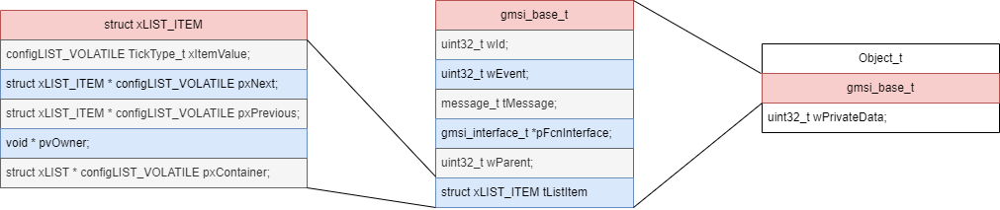
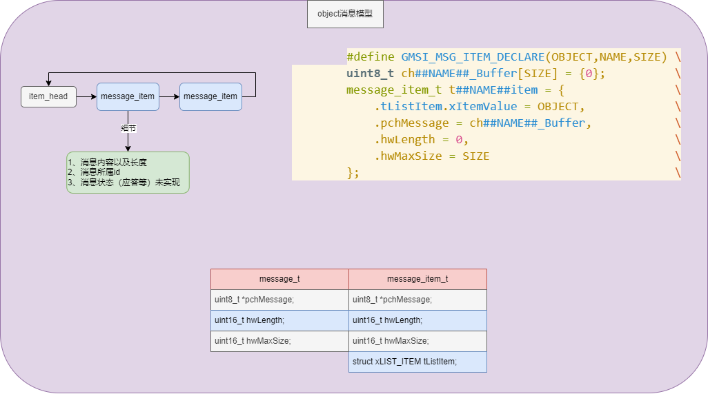

### object



#### register

```c
gmsi_base_cfg_t s_tTemplateBaseCfg = {
    .wId = TEMPLATE,                        // Set the ID to TEMPLATE
    .wParent = 0,                           // Set the parent to 0
    .FcnInterface = {
        .Clock = template_Clock,            // Set the Clock function to template_Clock
        .Run = template_Run,                // Set the Run function to template_Run
    },
};

int template_Init(uintptr_t wObjectAddr, uintptr_t wObjectCfgAddr)
{
    // Convert the given addresses to pointers
    template_t *ptThis = (template_t *)wObjectAddr;
    template_cfg_t *ptCfg = (template_cfg_t *)wObjectCfgAddr;

    // Check if the pointers are not NULL
    if (ptThis == NULL || ptCfg == NULL) {
        GLOG_PRINTF("Error: ptThis or ptCfg is NULL.");
        return GMSI_EFAIL;
    }

    /* Copy the configuration members to the object */

    /* Initialize the hardware */

    // Register the object in the GMSI list
    ptThis->ptBase = &s_tTemplateBase;
    if (ptThis->ptBase == NULL) {
        return GMSI_EAGAIN;
    } else {
        s_tTemplateBaseCfg.wParent = wObjectAddr;
        return gbase_Init(ptThis->ptBase, &s_tTemplateBaseCfg);
    }
}
```

### message



#### create

```c
// 创建一个有限长度的消息项
#define GMSI_MSG_ITEM_DECLARE(OBJECT,NAME,SIZE)                             \
        uint8_t ch##NAME##_Buffer[SIZE] = {0};                              \
        message_item_t t##NAME##item = {                                    \
            .tListItem.xItemValue = OBJECT,                                 \
            .pchMessage = ch##NAME##_Buffer,                                \
            .hwLength = 0,                                                  \
            .hwMaxSize = SIZE                                               \
        };                                                                  \
```

#### update data

```c
#define GMSI_MSG_ITEM_UPDATE(NAME, MESSAGE, LENGTH)                         \
    do{                                                                     \
        if((t##NAME##item).hwMaxSize >= LENGTH)                             \
        {                                                                   \
            memcpy((t##NAME##item).pchMessage, MESSAGE, LENGTH);            \
            (t##NAME##item).hwLength = LENGTH;                              \
        }                                                                   \
        else                                                                \
        {                                                                   \
            (t##NAME##item).hwLength = 0;                                   \
        }                                                                   \
    }while(0)
```

#### rev_send data

### event

#### post

#### pend


