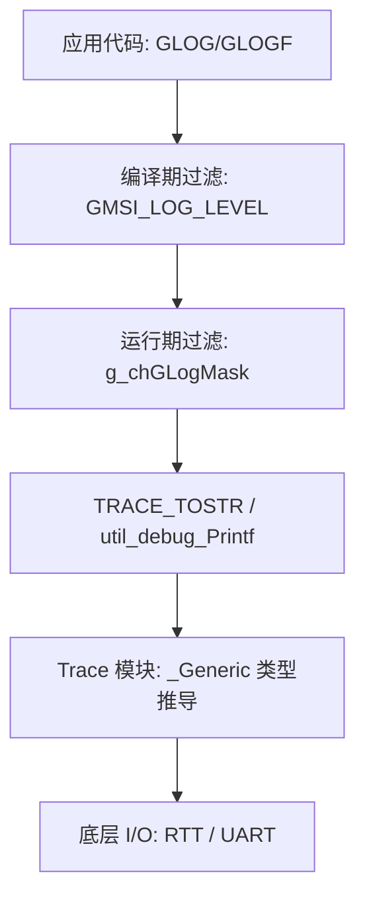

# GMSI 日志与 Trace 系统架构指南

本文档面向开发者，深入解析 GMSI 框架中 `GLOG` 日志系统及其底层 `Trace` 模块的实现机制。

---

## 1. 核心架构

GMSI 的日志系统采用分层设计，从上到下分为：应用接口层、过滤控制层、多态转换层、以及硬件适配层。



---

## 2. 双重过滤机制

为了兼顾性能与灵活性，`GLOG` 采用了两级过滤：

### 2.1 编译期裁剪
通过 `GMSI_LOG_LEVEL` 宏控制。如果编译级别设为 `INFO`，那么所有 `DEBUG` 级别的日志代码在预处理阶段就会被剔除，完全不占据 Flash 空间，也无运行开销。

### 2.2 运行期开关
通过 `g_chGLogMask` 位掩码控制。
- 每个级别对应一个 bit（E=bit0, W=bit1, I=bit2, D=bit3）。
- 开发者可以通过 `gshell` 的 `log` 命令动态修改该掩码，在不重新烧录的情况下开关特定级别的输出。

---

## 3. Trace 模块：C11 多态实现

`Trace` 模块是 GMSI 处理复杂类型转换的核心。它利用 C11 的 `_Generic` 关键字实现了类似 C++ 函数重载的效果。

### 3.1 自动类型推导
在 `trace.h` 中，通过宏定义了类型映射：
```c
#define __TRACE_TOSTRING_1(__OP1) \
    _Generic((__OP1), \
        const char *: TRACE.ToString.String, \
        int32_t  : TRACE.ToString.Int32, \
        float    : TRACE.ToString.Float, \
        // ... 其他类型
    )(__OP1)
```
当你调用 `TRACE_TOSTR(123)` 时，预处理器会自动选择 `TRACE.ToString.Int32(123)` 进行处理。

### 3.2 格式化器 (Formatters)
`Trace` 内部并不直接调用 `sprintf`（为了减小代码体积），而是调用高度优化的轻量级格式化函数：
- `trace_fmt_hex32`: 十六进制转换。
- `trace_fmt_int32`: 十进制转换。
- `trace_fmt_float`: 浮点数转换（支持精度控制，不依赖庞大的浮点库）。

---

## 4. 硬件适配 (Low-Level I/O)

`Trace` 最终通过 `TRACE_MCU_WRITE_STRING` 宏将数据送出。在默认配置下：
- 该映射通常指向 `SEGGER_RTT_WriteString(0, s)`。
- **注意**：日志默认走 **RTT Channel 0**，这与波形数据（Channel 1）在物理通道上是隔离的，避免了高频波形干扰控制台阅读。

---

## 5. 初始化真相：框架 vs 业务

在代码中你可能会看到两种初始化调用，它们的物理意义完全不同：

### 5.1 TRACE.Init(NULL) —— 架构占位
在 `main.c` 中调用的 `TRACE.Init(NULL)` 目前是 **Dummy 实现**。
- **现状**：由于 I/O 路径（RTT）已在编译期静态驱动，`Init` 函数内部为空。
- **目的**：符合 `i_trace_t` 接口规范，为未来动态切换 I/O 后端（如 UART）留出扩展槽位。

### 5.2 业务模块 .Init() —— 功能必须
与 `TRACE.Init` 不同，业务模块（如 `gwaveform.Init`）是**必须调用**的。
- **逻辑**：RTT 默认仅开启 Channel 0。业务模块的 `Init` 负责申请 Channel 1 或更高索引，并配置独立的 RAM 缓冲区及阻塞模式。
- **后果**：如果不调用业务模块的 `Init`，底层通道将无法建立。

---

## 5. 开发者进阶：自定义格式化

开发者可以通过扩展 `Trace` 接口来支持自定义结构体的打印，只需在 `ToString` 结构体中增加成员函数，并更新 `_Generic` 映射表即可。

---

> [!TIP]
> **性能建议**：虽然 `GLOG` 很方便，但在极高频（如 10kHz 以上）的中断内，建议优先使用 `gwaveform` 进行数据监测，因为日志的字符串格式化开销仍远大于二进制波形传输。
