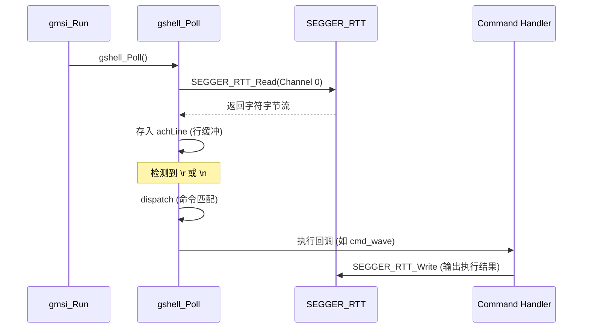

# GMSI 极简调试 Shell (gshell) 进阶指南

`gshell` 是 GMSI 提供的命令交互系统，其设计的核心目标是 **“零手动配置”** 与 **“低资源占用”**。

---

## 1. 自动初始化内核

`gshell` 之所以能做到开箱即用，是因为它利用了链接器段（Linker Section）技术。

### 1.1 `init_infos` 自动发现
通过 `GMSI_SHELL_CMD` 宏注册命令时，预处理器会生成一个静态结构体并将其强行放入名为 `init_infos` 的特殊段中。在 `gmsi_Init()` 执行期间，框架会遍历此段中的所有项，自动调用 `gshell_RegisterCmd` 完成注册。

### 1.2 BSS 与延迟初始化
- **物理内存**：`gshell` 的所有核心变量（命令表、行缓冲区）都位于 BSS 段，由 C 启动代码自动清零。
- **逻辑激活**：在 `gmsi_Run()` 第一次触发 `gshell_Poll()` 时，系统会自动绑定 RTT IO 后端并加载 `help/ver/list` 等内置命令。

---

## 2. 自定义 I/O 后端 (UART/USB/BT)

`gshell` 的一大优势是它不硬绑定 RTT。通过使用 `gshell_SetIO()`，你可以将 Shell 迁移至 UART、USB-CDC 甚至蓝牙串口。

### 2.1 实现 I/O 适配器
你需要定义一个 `gshell_io_t` 结构体，包含非阻塞读取函数和发送函数：

```c
/* 1. 实现底层回调 (以 UART 为例) */
static unsigned my_uart_read(char *pchBuf, unsigned hwSize) {
    // 关键：必须是非阻塞的，没有数据立即返回 0
    return UART_Receive_NonBlock(pchBuf, hwSize);
}

static void my_uart_write(const char *pchBuf, unsigned hwSize) {
    UART_Send_Block(pchBuf, hwSize);
}

/* 2. 定义 IO 对象 */
static const gshell_io_t s_tMyUART_IO = {
    .pfcnRead  = my_uart_read,
    .pfcnWrite = my_uart_write,
};

/* 3. 在 Poll 调用前注入 (如 main 初始化阶段) */
int main(void) {
    // init hardware
    
    gshell_SetIO(&s_tMyUART_IO); // 覆盖默认的 RTT 通道
    gmsi_Init(&s_tGmsi);
    
    while(1) {
        gmsi_Run();
    }
}
```

### 2.2 注意事项
- **非阻塞原则**：`pfcnRead` 绝对**不能等待**数据。如果它由于等待输入而阻塞，整个系统的滴答和任务都会停摆。
- **静态生存期**：传递给 `SetIO` 的结构体指针必须指向一个全局或静态变量，因为 `gshell` 会在运行期持续引用它。

---

## 3. 深入理解 RTT 控制块

`gshell` 的数据交互依赖于 SEGGER RTT 的核心数据结构 `SEGGER_RTT_CB`（控制块）。

### 3.1 控制块结构
在中端侧，RTT 控制块被定义为：
```c
typedef struct {
  char                    acID[16];          // 魔法字符串 "SEGGER RTT"
  int                     MaxNumUpBuffers;   // 上行通道总数
  int                     MaxNumDownBuffers; // 下行通道总数
  SEGGER_RTT_BUFFER_UP    aUp[N];            // 发送缓存描述符
  SEGGER_RTT_BUFFER_DOWN  aDown[N];          // 接收缓存描述符
} SEGGER_RTT_CB;
```
`gshell` 默认复用的是 **Channel 0**（Terminal）。其底层缓存 `_acUpBuffer` (1024B) 和 `_acDownBuffer` (16B) 在 `SEGGER_RTT.c` 中静态分配，并在控制块中绑定。

### 2.2 调试器如何找到它？
调试器（如 J-Link）连接芯片后，会在 RAM 中全速搜索 `"SEGGER RTT"` 字符串。一旦找到，它就能读取 `aUp` 和 `aDown` 的指针及其读写偏移量（RdOff/WrOff），从而实现无需 CPU 干预的数据搬运。

---

## 3. I/O 调用流分析

`gshell` 的运行遵循严格的非阻塞轮询机制：



**关键点：**
- **Shell UI 输入/输出**：直接调用 RTT 读写，不经过日志（Trace）过滤。
- **并发安全**：RTT 通道的 `RdOff` 和 `WrOff` 被声明为 `volatile`，确保了 PC 端（通过 SWD 修改）和 MCU 端修改的可见性。

---

## 4. 缓冲区对比 (开发者关注)

| 缓冲区 | 角色 | 大小 | 备注 |
| :--- | :--- | :--- | :--- |
| **`_acUpBuffer`** | RTT 驱动层发送缓存 | 1024 Byte | 位于 `SEGGER_RTT.c`，承载控制台所有输出。 |
| **`_acDownBuffer`** | RTT 驱动层接收缓存 | 16 Byte | 承载用户键盘输入。 |
| **`achLine`** | Shell 应用层行缓存 | 32 Byte | `gshell.c` 私有内存，决定了单条命令的最大长度。 |

---

## 5. 重要原则

> [!IMPORTANT]
> **I/O 非阻塞原则**：
> 在手动实现 `gshell_io_t` 时，`pfcnRead` **必须** 立即返回 0（如果没有字符）。任何形式的阻塞读取都会导致整个 GMSI 调度循环挂起。
