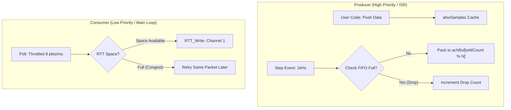

# MODUS 实时波形采集 (mwaveform) 深度指南

`mwaveform` 是 MODUS 为高性能控制算法（如 FOC 电机控制）打造的高采样率数据传输方案。其设计的核心挑战在于：如何在不阻塞实时算法的前提下，尽可能实时地传输二进制数据流。

---

## 1. 核心架构：多级帧 FIFO 模型

为了解决主循环抖动（Jitter）导致的波形断裂，`mwaveform` 采用了 **保护型多级帧 FIFO (Block FIFO)** 架构。该设计在保证实时性的同时，提供了极强的抖动吸收能力。



### 1.1 关键特性：写保护与平滑推送
1. **写保护 (Overrun Protection)**：当 RTT 链路完全堵塞导致 FIFO 填满时，系统会**主动丢弃新采样**。这保证了正在传输的旧数据不会被物理覆盖，从而维护了 PC 端解码的协议完整性。
2. **平滑推送 (Smoothing)**：主循环每次 `Poll` 限定最多发送 8 个包。这避免了在大规模积压后瞬间爆发出海量数据流冲击物理链路，极大地降低了 RTT 同步丢失的概率。
3. **确定性延时**：通过增大 FIFO 深度，可以吸收主循环长达数十毫秒的卡顿而不丢样点。


---

## 2. 内存与带宽配置 (RAM Configuration)

`mwaveform` 的内存占用主要由 FIFO 深度和 RTT 物理缓冲区决定。用户可以通过在 `userconfig.h` 中定义以下宏进行优化：

| 宏定义 | 默认值 | 建议范围 | 说明 |
| :--- | :--- | :--- | :--- |
| **`MWAVEFORM_FIFO_DEPTH`** | 16 | 8 ~ 64 | FIFO 帧数量。由于主循环抖动大时，可调大此值（如64）以吸收延迟。 |
| **`MWAVEFORM_RTT_BUFFER_SIZE`** | 1024 | 512 ~ 8192 | RTT 物理环形缓冲区大小。1kHz 全速采样建议使用 4096 以上。 |
| **`MWAVEFORM_MAX_CHANNELS`** | 16 | 1 ~ 32 | 最大支持通道数。减小此值可显著降低每一帧的 RAM 占用。 |

### 2.1 典型 RAM 瘦身方案 (示例)
```c
/* 在 userconfig.h 中根据实际需求降低占用 */
#define MWAVEFORM_MAX_CHANNELS      4       // 仅支持 4 通道
#define MWAVEFORM_FIFO_DEPTH        8       // 减小 FIFO 深度
#define MWAVEFORM_RTT_BUFFER_SIZE   512     // 最小化 RTT 占用
```


---

## 3. 函数调用位置指南 (核心)

| 函数 | 推荐位置 | 频率/触发 | 说明 |
| :--- | :--- | :--- | :--- |
| **`mwaveform.Init`** | `main()` 初始化段 | 仅一次 | 分配 RTT 缓冲区，绑定协议。 |
| **`mwaveform.AddChannel`** | `app_init()` 阶段 | 仅一次 | 注册通道名和缩放系数。 |
| **`mwaveform.Start`** | 业务准备就绪后 | 仅一次 | 开启传输开关。 |
| **`mwaveform.Push`** | 高频中断 (ISR) | 业务频率 | 写入当前瞬时物理值到缓存。 |
| **`mwaveform.Step`** | 高频中断 (ISR) | 采样频率 | 将所有缓存的数据打包并提交至双缓冲。 |
| **`mwaveform.Poll`** | 主循环 | 尽力而为 | 实际执行内存到 RTT 驱动的数据拷贝。 |

---

## 4. 典型调用范式 (Standard Usage Template)

```c
/* 1. 初始化与注册 (main 入口或 app_init) */
void sys_init(void) {
    mwaveform.Init(NULL);                             // RTT 通道建立
    s_chU = mwaveform.AddChannel("Phase_U", 10.0f);   // 注册通道
    mwaveform.Start();                                // 开启传输
}

/* 2. 数据采集 (高频中断，如 PWM 10kHz) */
void PWM_IRQHandler(void) {
    float fVal = read_current_sensor();
    mwaveform.Push(s_chU, fVal);                      // 写入缓存 (极速)
    mwaveform.Step();                                 // 封包并切换双缓冲 (ISR安全)
}

/* 3. 后台搬运 (主循环) */
int main(void) {
    sys_init();
    while(1) {
        modus_Run(); // 内部调用 mwaveform.Poll() 完成 RTT 发送
    }
}
```


---

## 5. 自定义协议扩展 (Custom Protocol)

`mwaveform` 的核心逻辑与具体的字节打包方式是分离的。你可以通过实现 `mwaveform_protocol_t` 接口来定义自己的私有传输协议。

### 5.1 实现协议接口
你需要实现 `pack_data` (打包采样数据) 和 `pack_desc` (打包描述符) 两个函数：

```c
static uint16_t my_pack_data(uint8_t *pchBuffer, 
                             const int16_t *ahwSamples, 
                             const uint8_t *abMask, 
                             uint8_t chCount, 
                             uint8_t chSeq) 
{
    // 在此处编写你的私有帧结构
    // 返回打包后的总字节数
    return frame_len;
}

static const mwaveform_protocol_t s_tMyProtocol = {
    .pack_data = my_pack_data,
    .pack_desc = default_waveform_protocol.pack_desc, // 也可以直接复用默认的描述符打包
};
```

### 5.2 注入协议
在初始化时，将自定义协议对象的指针传入即可：
```c
void sys_init(void) {
    mwaveform.Init(&s_tMyProtocol); // 注入自定义协议
    // ...
}
```

### 5.3 上位机对齐 (Host Side Sync)
如果你修改了底层的打包协议，**上位机软件也必须进行相应的解析修改**。对于 `SuperWaveform` (C++)：
1. **修改源码**：找到 `tools/superwaveform/src/protocol_parser.cpp`。
2. **逻辑对齐**：修改 `ProtocolParser::Feed` 函数，确保其解包逻辑与你 MCU 端的 `pack_data` 镜像对称。
3. **重新编译**：在 `tools/superwaveform` 目录下执行 `make` 重新生成 `.exe` 文件。

---

## 6. 传输协议与自愈机制

### 6.1 二进制协议
1. **同步头 (2B)**：固定为 `0xAA 0x55`。
2. **序列号 (1B)**：用于检测 PC 端是否发生丢包。
3. **掩码 Mask (1+ B)**：仅传输被 `Push` 修改过的通道。
4. **数据段 (NX 2B)**：各个通道 of `int16_t` 累加数据。
5. **CRC8 (1B)**：整帧校验。

### 6.2 热插拔同步
`mwaveform` 每一秒会自动向 RTT 发送一帧 **描述符帧 (Descriptor Frame)**。这意味着即便上位机工具是在系统运行中途打开的，也能在 1 秒内自动获取通道配置并开始绘图。

---

## 7. 性能监控与诊断 (Diagnostics)

为了确保高频采样下的系统健康，可通过内置命令或 API 观测：

### 7.1 `wave drop` 命令
- **Cumulative**: 自运行以来的总丢帧数（由于 PC 取数太慢导致 FIFO 溢出）。
- **Total**: 历史尝试发送的总帧数。
- **百分比**: 反映了当前物理链路的承载压力。

### 7.2 `RTT Congest` (拥塞次数)
反映了 MCU 写入 RTT 时发现缓冲区已满的频率。如果该值极高（每秒上万次），说明物理链路（如 SWD 时钟）已达上限，建议增加 SWD 频率（12MHz+）。

---

> [!TIP]
> **性能分频**：通过 `mwaveform.SetRate(n)` 设置。例如算法运行在 10kHz，设置 `SetRate(10)` 可以输出 1kHz 的降采样波形，极大地减轻带宽压力。
