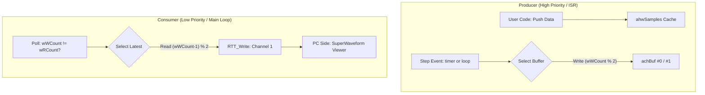

# GMSI 实时波形采集 (gwaveform) 深度指南

`gwaveform` 是 GMSI 为高性能控制算法（如 FOC 电机控制）打造的高采样率数据传输方案。其设计的核心挑战在于：如何在不阻塞实时算法的前提下，尽可能实时地传输二进制数据流。

---

## 1. 核心架构：双缓冲 (Ping-Pong) 模型

为了实现“中断内安全打包”与“主循环外异步传输”的解耦，`gwaveform` 默认采用了 **双缓冲 (Ping-Pong)** 架构。这种设计遵循“最新优先”原则。



### 1.1 关键特性：最新优先 (Newest-Wins)
`gwaveform` 在高频中断中直接将打包好的数据帧投入双缓冲区之一。其逻辑特点如下：
1. **零阻塞**：中断（Producer）永远不会等待主循环（Consumer），保证了算法执行的绝对确定性。
2. **低延迟**：主循环始终拉取并发送**最新的**一帧完整数据包。
3. **带宽自适应**：如果主循环处理过慢（如总线繁忙），中间的旧样点会被直接覆盖丢失，而不会累积延迟。这确保了在带宽受限时，观察到的波形仍然是当前实时发生的。

---

## 2. RTT 独立通道配置

与 `gshell` 复用默认通道不同，`gwaveform` 使用独立的传输路径：

```c
static int gwaveform_Init(const gwaveform_protocol_t *ptProtocol)
{
    memset(&s_tWave, 0, sizeof(s_tWave));

    // 配置通道1
    SEGGER_RTT_ConfigUpBuffer(GWAVEFORM_RTT_CHANNEL, "Waveform",
                              s_tWave.achRTTBuffer, GWAVEFORM_RTT_BUFFER_SIZE,
                              SEGGER_RTT_MODE_NO_BLOCK_SKIP);

    return GMSI_SUCCESS;
}
```

- **Channel 1**：专用波形通道，避免日志打印对二进制数据流的干扰。
- **RTT Buffer (512B)**：RTT 驱动层的物理缓冲区。建议在极高频率采样时根据需要增大。

---

## 3. 函数调用位置指南 (核心)

| 函数 | 推荐位置 | 频率/触发 | 说明 |
| :--- | :--- | :--- | :--- |
| **`gwaveform.Init`** | `main()` 初始化段 | 仅一次 | 分配 RTT 缓冲区，绑定协议。 |
| **`gwaveform.AddChannel`** | `app_init()` 阶段 | 仅一次 | 注册通道名和缩放系数。 |
| **`gwaveform.Start`** | 业务准备就绪后 | 仅一次 | 开启传输开关。 |
| **`gwaveform.Push`** | 高频中断 (ISR) | 业务频率 | 写入当前瞬时物理值到缓存。 |
| **`gwaveform.Step`** | 高频中断 (ISR) | 采样频率 | 将所有缓存的数据打包并提交至双缓冲。 |
| **`gwaveform.Poll`** | 主循环 | 尽力而为 | 实际执行内存到 RTT 驱动的数据拷贝。 |

---

## 4. 典型调用范式 (Standard Usage Template)

```c
/* 1. 初始化与注册 (main 入口或 app_init) */
void sys_init(void) {
    gwaveform.Init(NULL);                             // RTT 通道建立
    s_chU = gwaveform.AddChannel("Phase_U", 10.0f);   // 注册通道
    gwaveform.Start();                                // 开启传输
}

/* 2. 数据采集 (高频中断，如 PWM 10kHz) */
void PWM_IRQHandler(void) {
    float fVal = read_current_sensor();
    gwaveform.Push(s_chU, fVal);                      // 写入缓存 (极速)
    gwaveform.Step();                                 // 封包并切换双缓冲 (ISR安全)
}

/* 3. 后台搬运 (主循环) */
int main(void) {
    sys_init();
    while(1) {
        gmsi_Run(); // 内部调用 gwaveform.Poll() 完成 RTT 发送
    }
}
```


---

## 5. 自定义协议扩展 (Custom Protocol)

`gwaveform` 的核心逻辑与具体的字节打包方式是分离的。你可以通过实现 `gwaveform_protocol_t` 接口来定义自己的私有传输协议。

### 5.1 实现协议接口
你需要实现 `pack_data` (打包采样数据) 和 `pack_desc` (打包描述符) 两个函数：

```c
static uint16_t my_pack_data(uint8_t *pchBuffer, 
                             const int16_t *ahwSamples, 
                             const uint8_t *abMask, 
                             uint8_t chCount, 
                             uint8_t chSeq) 
{
    // 在此处编写你的私有帧结构
    // 返回打包后的总字节数
    return frame_len;
}

static const gwaveform_protocol_t s_tMyProtocol = {
    .pack_data = my_pack_data,
    .pack_desc = default_waveform_protocol.pack_desc, // 也可以直接复用默认的描述符打包
};
```

### 5.2 注入协议
在初始化时，将自定义协议对象的指针传入即可：
```c
void sys_init(void) {
    gwaveform.Init(&s_tMyProtocol); // 注入自定义协议
    // ...
}
```

### 5.3 上位机对齐 (Host Side Sync)
如果你修改了底层的打包协议，**上位机软件也必须进行相应的解析修改**。对于 `SuperWaveform` (C++)：
1. **修改源码**：找到 `tools/superwaveform/src/protocol_parser.cpp`。
2. **逻辑对齐**：修改 `ProtocolParser::Feed` 函数，确保其解包逻辑与你 MCU 端的 `pack_data` 镜像对称。
3. **重新编译**：在 `tools/superwaveform` 目录下执行 `make` 重新生成 `.exe` 文件。

---

## 6. 传输协议与自愈机制

### 6.1 二进制协议
1. **同步头 (2B)**：固定为 `0xAA 0x55`。
2. **序列号 (1B)**：用于检测 PC 端是否发生丢包。
3. **掩码 Mask (1+ B)**：仅传输被 `Push` 修改过的通道。
4. **数据段 (NX 2B)**：各个通道 of `int16_t` 累加数据。
5. **CRC8 (1B)**：整帧校验。

### 6.2 热插拔同步
`gwaveform` 每一秒会自动向 RTT 发送一帧 **描述符帧 (Descriptor Frame)**。这意味着即便上位机工具是在系统运行中途打开的，也能在 1 秒内自动获取通道配置并开始绘图。

---

## 7. 进阶探讨：无损 FIFO (gring) 架构 (Future Plan)

> [!NOTE]
> 该方案目前处于验证/备选阶段。如果你的应用场景**对波形完整性有绝对要求**（不能接受中间丢样点），可以考虑切换至该架构。

### 5.1 方案思路
将现有的双缓冲替换为深度更大的 **Ring Buffer (FIFO)**：
- **ISR 端**：所有生成的帧顺序排队到 2KB 的 FIFO 中。
- **Poll 端**：主循环以“削峰填谷”的方式批量清空 FIFO。
- **优势**：可以吸收主循环因复杂业务产生的几十毫秒级抖动，确保波形 100% 连续。

### 5.2 挑战与建议
实验表明，在 RTT 物理带宽不足或 host 软件接收延迟较大时，FIFO 容易溢出（Drop 数急剧上升）。
- 建议配合 **8MHz 以上的 SWD 速度** 使用。
- 需要确保 `gringbuf` 实现是单生产者单消费者 (SPSC) 锁无关的。

---

> [!TIP]
> **性能分频**：通过 `gwaveform.SetRate(n)` 设置。例如算法运行在 10kHz，设置 `SetRate(10)` 可以输出 1kHz 的降采样波形，极大地减轻带宽压力。
