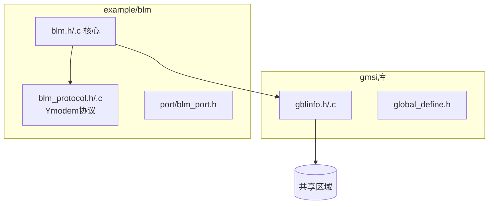

# Bootloader Manager (BLM) 实现计划 v5 (Final)

## 架构概览



---

## 通讯协议 (简化Ymodem)

### 控制字符

| 字符 | 值 | 说明 |
|------|-----|------|
| SOH | 0x01 | 128字节数据包起始 |
| EOT | 0x04 | 传输结束 |
| ACK | 0x06 | 确认 |
| NAK | 0x15 | 否认/请求重发 |
| CAN | 0x18 | 取消传输 |
| C | 0x43 | CRC模式请求 |

### 数据帧格式 (133字节)

```
+-----+-----+------+----------+----------+
| SOH | SEQ | ~SEQ | DATA[128]| CRC16[2] |
+-----+-----+------+----------+----------+
  1B    1B    1B      128B        2B
```

| 字段 | 说明 |
|------|------|
| SOH | 包起始 |
| SEQ | 包序号 (0-255循环) |
| ~SEQ | 包序号取反 |
| DATA | 128字节数据 (不足填充0x1A) |
| CRC16 | CRC-CCITT (高字节在前) |

### 传输流程

```
Bootloader                    上位机
    |                            |
    |-------- 发送 'C' --------->|  请求CRC模式
    |<------ SOH+包0(文件名) ----|  
    |-------- ACK -------------->|
    |-------- 'C' -------------->|  请求数据
    |<------ SOH+包1(数据) ------|
    |-------- ACK -------------->|
    |          ...               |
    |<------ EOT ----------------|  传输结束
    |-------- NAK -------------->|
    |<------ EOT ----------------|  确认结束
    |-------- ACK -------------->|
```

### CRC16计算 (CRC-CCITT)

```c
#define CRC_POLY    0x1021
uint16_t crc16_ccitt(uint8_t *pchData, uint16_t hwLen);
```

### 超时参数

| 参数 | 值 | 说明 |
|------|-----|------|
| 等待连接 | 3s | 发送'C'等待响应 |
| 包超时 | 1s | 收包超时重发NAK |
| 重试次数 | 10 | 最大重试次数 |

---

## Flash布局

| 区域 | 地址 | 大小 |
|------|------|------|
| Bootloader | 0x08000000 | 8KB |
| SharedInfo | 0x08002000 | 1KB |
| App | 0x08002400 | 剩余 |

---

## 共享信息结构体

```c
typedef struct {
    uint32_t wMagic;
    uint32_t wStructCrc;
    uint8_t  chBlMajor, chBlMinor;
    uint32_t wBlBuildTime;
    uint8_t  chAppMajor, chAppMinor;
    uint32_t wAppBuildTime, wAppCrc, wAppSize;
    uint8_t  chUpgradeFlag;  // 串口命令可设置
    uint8_t  chBootCount, chLastBootStatus, chHwVersion;
    uint32_t wDeviceId;
} gblinfo_shared_t;
```

---

## 文件清单

### gmsi库
- `global_define.h` - 新增GBLINFO_SHARED_ADDR
- `gblinfo.h/.c` - 共享信息模块

### example/blm
- `main.c`, `userconfig.h`
- `core/blm.h/.c` - 核心状态机
- `core/blm_protocol.h/.c` - Ymodem协议
- `port/blm_port.h` - 移植接口
- `port/blm_port_template.c`
