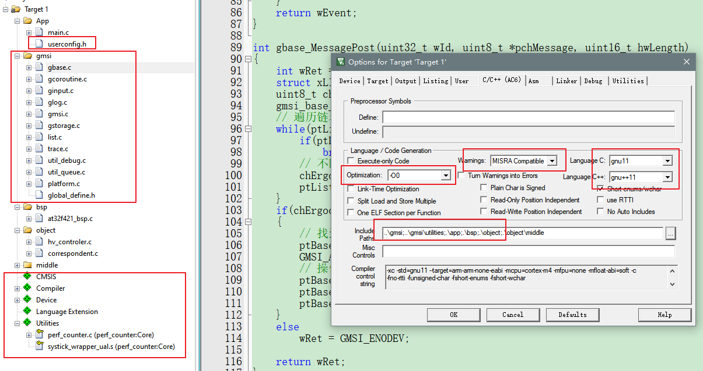

### WSL子系统

+ 启动windows系统的ubuntu子系统（**该教程看网上**）
+ 更新wsl系统环境

```sh
# 更新源
sudo apt-get update
# 更新软件
sudo apt-get upgrade
# 安装相关工具make clang git
sudo apt install clang make git
# 配置git
git config --global user.name "xxx"
git config --global user.email "xxx@yyy.com"
```

+ 拉取GMSI库代码

```sh
# 在用户home目录下创建个人文件夹（看个人喜好）
mkdir code_dir
cd code_dir
# 拉取代码
git clone https://gitee.com/wyxun/gmsi.git
# 测试编译确认环境是否有缺失
cd gmsi/example/posix_uart
make
# 正常情况可看到下面信息，正常生成可执行文件
# clang -std=c11 -W -Ofast -Wno-implicit-function-declaration -Wno-unused-parameter -Wno-int-to-pointer-cast -Wno-sign-compare -# Wno-compare-distinct-pointer-types -I../../gmsi -I/usr/include -I../../gmsi/utilities -I../../ThirdParty/plooc -#D_XOPEN_SOURCE=700 -DLINUX_POSIX -c main.c -o main.o
# clang -std=c11 -W -Ofast -Wno-implicit-function-declaration -Wno-unused-parameter -Wno-int-to-pointer-cast -Wno-sign-compare -# Wno-compare-distinct-pointer-types -I../../gmsi -I/usr/include -I../../gmsi/utilities -I../../ThirdParty/plooc -#D_XOPEN_SOURCE=700 -DLINUX_POSIX -c pc_uart.c -o pc_uart.o
# clang -std=c11 -W -Ofast -Wno-implicit-function-declaration -Wno-unused-parameter -Wno-int-to-pointer-cast -Wno-sign-compare -# Wno-compare-distinct-pointer-types -I../../gmsi -I/usr/include -I../../gmsi/utilities -I../../ThirdParty/plooc -fno-autolink -# Wall -lrt ../../gmsi/glog.o ../../gmsi/gcoroutine.o ../../gmsi/gmsi.o ../../gmsi/gstorage.o ../../gmsi/gbase.o # ../../gmsi/ginput.o ../../gmsi/utilities/trace.o ../../gmsi/utilities/util_queue.o ../../gmsi/utilities/list.o # ../../gmsi/utilities/util_debug.o main.o pc_uart.o pc_clock.o -o demo
# 执行程序,可看到程序正常执行
./demo
```

### keil环境

+ 拉取库代码

```sh
git clone https://gitee.com/wyxun/gmsi.git
```

+ 创建项目

```sh
cd gmsi
# 创建project文件夹
# 在project文件下创建keil项目
```

+ 配置项目
    + optimization -o0：方便调试，项目后期可改成**-fast**且**关闭debug**：__NO_USE_LOG__
    + **GMSI**：根据截图上的源文件进行包含
    + **Device**：根据芯片选择对应的库文件
    + **Language Extension**：启用PLOOC，扩展使用**LOG_OUT**调试接口
    + 



+ 编写object程序

    + 参看**example**下的**template**例子

    ```c
    // 挂载对象到gmsi内部调用
    static gmsi_base_t s_tExampleBase;
    gmsi_base_cfg_t s_tExampleBaseCfg = {
        .wId = EXAMPLE,
        .wParent = 0,
        .FcnInterface = {
            .Clock = example_Clock,
            .Run = example_Run,
        },
    };
    
    int example_Init(uintptr_t wObjectAddr, uintptr_t wObjectCfgAddr)
    {
        int wRet = GMSI_SUCCESS;
        example_t *ptThis = (example_t *)wObjectAddr;
        example_cfg_t *ptCfg = (example_cfg_t *)wObjectCfgAddr;
        GMSI_ASSERT(NULL != ptThis);
        GMSI_ASSERT(NULL != ptCfg);
        
        ptThis->ptBase = &s_tExampleBase;
        ptThis->chExampleData = ptCfg->chExampleData;
    
        if(NULL == ptThis->ptBase)
            wRet = GMSI_EAGAIN;
        else
        {
            s_tExampleBaseCfg.wParent = wObjectAddr;
            wRet = gbase_Init(ptThis->ptBase, &s_tExampleBaseCfg);
        }
        return wRet;
    }
    ```

+ 编写**main**主程序

```c
int main(void)
{
    system_clock_config();
    // 硬件初始化
    bsp_Init();

    // object初始化
    hvcontroler_Init((uintptr_t)&tHvControler, (uintptr_t)&tHvControlerCfg);
    correspondent_Init((uintptr_t)&tCorrespondent, (uintptr_t)&tCorrespondentCfg);
    example_Init((uintptr_t)&tExample, (uintptr_t)&tEexampleCfg);
    // 初始化gmsi内部模块
    gmsi_Init(&tGmsi);

    while(1)
    {
        // gmsi主程序挂载
        gmsi_Run();
    }
    return 0;
}

// 1ms中断定时器
void timer_handler(int signum)
{
    // gmsi时钟挂载
    gmsi_Clock();
}
```

