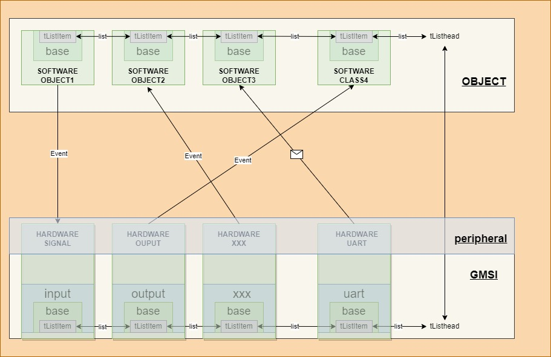
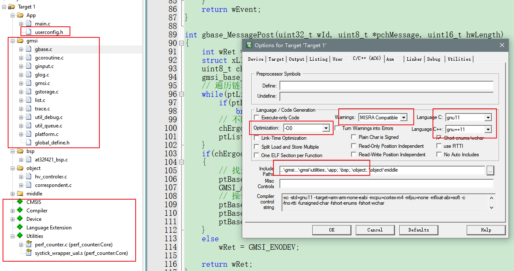

# Modus — 嵌入式 MCU 软件框架

Modus 是一个轻量级、面向对象且高度可移植的嵌入式软件框架。它致力于通过
抽象硬件接口（GDI）与业务逻辑，提供一套统一的对象管理机制，支持任务
的自动发现、初始化和事件驱动运行。


## 核心特性
- **面向对象设计**：支持多实例，每个模块（驱动、任务、应用）都封装为独立的对象。
- **自动初始化机制**：引入链接脚本段（Linker Section），利用 `MODUS_DECLARE_OBJECT`
  宏实现模块的零修改自动注册，无需手动更新 `main.c` 中的初始化列表。
- **非阻塞事件机制**：内置事件挂起（Pend）与发布（Post）机制，极大简化了异步任务逻辑。
- **协程/状态机支持**：无缝集成 `plooc` (Protected Low-overhead Object-Oriented 
  Programming in C) 与 `perf_counter` 的协程能力，让复杂的时序逻辑编写如同顺序代码。
- **跨平台一致性**：完美适配 **Keil (AC6)**, **LLVM (Clang)**, **GCC**，支持嵌入式裸机与 
  **POSIX (Linux/WSL)** 环境。

---

## 快速开发
### 1. POSIX (WSL/Linux) 环境
建议在 Windows 下安装 Ubuntu 子系统，使用以下流程：
```bash
# 安装基础编译环境
sudo apt-get update
sudo apt install clang make git

# 获取源码并运行示例
git clone https://gitee.com/wyxun/modus.git
cd modus/example/template
make
./build/example
```

### 2. Keil 环境配置
- **优化选项**：建议使用 `-Ofast` 以获得最佳性能，配置 `-g` 支持调试。
- **编译器支持**：必须使用 **Arm Compiler 6 (AC6)**，并开启 `GNU11` 与 `C11` 标准。
- **预定义宏**：
  - `__NO_USE_LOG__`：禁用日志输出。
  - `__NO_USE_ASSERT`：禁用断言检测。
- **语言扩展**：MODUS 强依赖 `plooc` 实现对象封装，请确保包含路径中含有 `lib/plooc`。



---

## MODUS 日志系统 (LOG)

MODUS 提供两个互补的日志宏，以覆盖嵌入式开发中的不同场景。

### 1. `MLOG` — 类型自动分发（高效、零缓存）
通过 `plooc` 变参技术将每个参数的类型自动映射到底层 `TRACE` 接口处理函数。它不需要格式化解析，性能最高，且类型安全。

```c
#include "mdebug/util_debug.h"

// 简单字符串
MLOG(I, "System startup.\n");

// 混合字符串与变量 (自动按类型分发)
MLOG(W, "Sensor alert! ID: ", wID, ", Val: ", hwVal, "\n");

// 十六进制输出 (手动带 0x)
MLOG(D, "Buffer Head: 0x", wHead, "\n");
```

### 2. `MLOGF` — 格式化输出（标准风格、轻量级）
内部调用手写格式化解析器（无 `snprintf` 依赖），支持常用的格式符：`%d %u %x %s %c` 以及补零和宽度（如 `%08x`）。

```c
// 常用整数格式化
MLOGF(I, "Current tick: %d\n", wTicks);

// 带补零的十六进制
MLOGF(D, "Address: 0x%08x\n", (uintptr_t)ptThis);

// 组合字符串与字符
MLOGF(E, "Module %s error (code: %c)\n", "USART", 'A' + chID);
```

### 3. 日志级别 (Severity Levels)
可以通过在 `userconfig.h` 中定义 `MODUS_LOG_LEVEL` 来控制编译期过滤级别：
- `MODUS_LOG_LEVEL_NONE`  (0)
- `MODUS_LOG_LEVEL_ERROR` (1) - 简写 `E`
- `MODUS_LOG_LEVEL_WARN`  (2) - 简写 `W`
- `MODUS_LOG_LEVEL_INFO`  (3) - 简写 `I` (默认级别)
- `MODUS_LOG_LEVEL_DEBUG` (4) - 简写 `D`

### 4. 设计详情
更多关于 LOG 的零缓存设计与实现细节，请参考 [LOG 设计文档](doc/superpowers/LOG_design.md)。

---

## mshell — 极简调试 Shell

MODUS 内置轻量级 RTT 调试 Shell，随 `modus_Run()` 自动轮询，**无需修改主循环**，连接
J-Link RTT Viewer 即用。可通过 `mshell_SetIO()` 将 I/O 后端从默认 RTT 替换为 UART。

### 内置命令

| 命令 | 说明 |
|------|------|
| `help` | 列出所有命令 |
| `ver`  | 打印 MODUS 版本 |
| `list` | 查看所有注册的 mbase 对象（id、event） |
| `post <id_hex> <event_hex>` | 向指定对象投递事件 |
| `log [-E][-W][-I][-D]` | 运行期开关 MLOG 各级别（无参数 = 显示当前状态） |

### 注册自定义命令

```c
#include "mdebug/mshell.h"

static void cmd_burn(const char *args) {
    MLOGF(I, "Burn-in started\r\n");
}
/* 零代码初始化：在 .c 中定义宏即可自动注册 */
MODUS_SHELL_CMD(burn, cmd_burn, "Burn-in test");
```

### 运行期 Log 级别控制

`g_chGLogMask` 默认由 `MLOG_MASK_DEFAULT`（全开，0x0F）初始化。
可在 `userconfig.h` 中覆盖启动默认值，或通过 `log` 命令动态切换，无需重编译。

详细配置、UART 后端替换及注意事项参考 [mshell 使用指南](doc/mshell.md)。

---

## mwaveform — 实时波形采集与可视化

MODUS 提供一套从 MCU 采集到 PC 实时显示的波形方案，特别适用于 FOC 电机、PID 调试等高频信号可视化场景。

### 核心优势
- **极致性能**：底层采用 SPSC 无锁环形缓冲区，20kHz 采样下 CPU 占用极低。
- **上位机支持**：配套 Python 可视化工具，基于 `pyqtgraph` 实现，支持 OpenGL 加速。

### 快速使用
1. **MCU 侧注册通道**：
   ```c
   uint8_t s_chIa = mwaveform_AddChannel("Motor_Ia", 1000.0f);
   mwaveform_Start();
   ```
2. **在中断中推送数据**：
   ```c
   mwaveform_Push(s_chIa, fCurrentIa);
   mwaveform_Commit();
   ```
3. **PC 侧启动查看器**：
   ```bash
   python tools/mwaveform/viewer.py
   ```

详细设计、协议格式及性能数据请参考 [mwaveform 完整文档](doc/mwaveform.md)。

---

## MODUS 命名规范 (Naming Convention)

为了保持代码库的统一与整洁，请严格遵守以下命名规范：

1. **类型定义（Type Definition）**：全小写加下划线，必须以 `_t` 结尾。例如 `modus_t`, `mbase_t`, `mlist_t`。
2. **函数接口（Function API）**：模块名前缀（全小写） + 下划线 + 帕斯卡命名法（首字母大写）。例如 `modus_Init()`, `mbase_EventPost()`, `mlist_Init()`。
3. **宏定义（Macros）**：全大写加下划线。例如 `MODUS_DECLARE_OBJECT()`, `MLOG()`, `MLIST_IS_EMPTY()`。
4. **全局变量（Global Variables）**：通常使用 `g_` 前缀（如 `g_hwSystemDataArrary`）。此规则属于用户业务层全局习惯，不受核心框架名称影响。

---

## 模块开发指南 (Object Template)

MODUS 将每个功能单元抽象为“对象”。参考 `example/template` 目录，一个标准的 
MODUS 对象由以下部分组成：

### 1. 结构定义 (`template.h`)
```c
/* 模块配置参数 */
typedef struct {
    uint8_t  *pchRingBuffer;
    uint16_t  hwRingSize;
} template_cfg_t;

/* 模块对象实体 */
typedef struct {
    modus_base_t *ptBase;   /* 必须包含 MODUS 基础类指针 */
    int          wFd;      /* 模块私有数据 */
} template_t;

int template_Init(uintptr_t wObjectAddr, uintptr_t wObjectCfgAddr);
```

### 2. 功能实现 (`template.c`)
模块物理行为通过 `Init`, `Clock`, `Run` 三个钩子函数挂载到框架：
```c
static modus_base_t s_tTemplateBase; // 静态分配基础类实例
static modus_base_cfg_t s_tTemplateBaseCfg = {
    .wId = TEMPLATE_ID, // 唯一标识符
    .FcnInterface = {
        .Clock = template_Clock, // 定时调用 (1ms)
        .Run   = template_Run,   // 主循环调用
    },
};

int template_Init(uintptr_t wObjectAddr, uintptr_t wObjectCfgAddr) {
    template_t *ptThis = (template_t *)wObjectAddr;
    template_cfg_t *ptCfg = (template_cfg_t *)wObjectCfgAddr;
    
    ptThis->ptBase = &s_tTemplateBase;
    s_tTemplateBaseCfg.wParent = wObjectAddr; // 记录父对象指针
    
    // 初始化私有资源...
    
    return mbase_Init(ptThis->ptBase, &s_tTemplateBaseCfg);
}

int template_Run(uintptr_t wObjectAddr) {
    template_t *ptThis = (template_t *)wObjectAddr;
    // 获取事件并处理
    uint32_t wEvent = mbase_EventPend(ptThis->ptBase);
    if (wEvent) { /* handle event */ }
    return MODUS_SUCCESS;
}
```

### 3. 对象声明与注册 (`main.c`)
无需在主循环代码中手动添加。只需一行宏声明，框架启动时即可自动初始化并开始调
度所有对象。
```c
#include "modus.h"
#include "template.h"

/* 声明对象及初始参数 */
MODUS_DECLARE_OBJECT(template, MyTemplate, 
    .hwRingSize = 64,
    .pchRingBuffer = s_chBuffer
);
```

---

## 编码与命名规范
遵循以下前缀规则（匈牙利命名法变体），可确保代码意图一目了然：

| 前缀 | 原始含义 | 示例 | 备注 |
|:---|:---|:---|:---|
| `ch` | `char / uint8_t` | `chState` | 单字节状态或数据 |
| `hw` | `uint16_t` | `hwBufferSize` | 半字 (Half-Word), 16位长度 |
| `w` | `uint32_t` | `wEvent` | 字 (Word), 32位变量 |

## 核心组件与工具

### 🛠️ SuperWaveform 分析工具
位于 `tools/superwaveform`，这是一个高性能的波形可视化利器：
*   **实时分析**：支持多通道实时采集，具备波形锁定、时间窗口缩放功能。
*   **精密测量**：按 `Space` 键开启虚线十字测量，支持频率、时间差、幅值差实时计算。
*   **数据归档**：一键保存符合年月日时分秒格式的规范 CSV 实验报告。
*   **离线回放**：专业的多窗口离线查看器，支持对历史数据进行缩放和平移。

### 📦 MODUS 框架核心
*   **MLOG**: 分级日志系统。
*   **GWaveform**: 极简的嵌入式波形上传协议。
*   **GShell**: 交互式 RTT/串口命令行。

| `b` | `bool` | `bIsRunning` | 布尔标志 |
|:---|:---|:---|:---|
| `pt` | `Pointer to Type`| `ptThis`, `ptMotor`| 指向结构体或自定义类型的指针 |
| `pch`| `uint8_t *` | `pchBuffer` | 指向字节流的指针 |
| `pfcn`| `Function Ptr` | `pfcnCallback` | 函数指针 |
| `s_` | `Static` | `s_tModusBase` | 静态变量 (文件作用域) |
| `g_` | `Global` | `g_hwCount` | 全局变量 |

- **行宽限制**：所有源代码行的最大长度不得超过 **86个字符**。

---

## GStorage — 持久化存储模块

`mstorage` 提供自动 CRC 校验的数据持久化能力：当 RAM 中的数据发生变化时，
定时检测并将数据写入 Flash；系统启动时自动从 Flash 恢复数据。

### 功能特性
- **定时自动保存**：以 CRC 变化检测为触发，避免频繁擦写
- **CRC-16 完整性校验**：读取时自动验证，损坏时打印告警
- **Erase-before-Write**：写入前自动执行 Unlock → Erase → Write → Lock
- **GDI 接口解耦**：框架层与芯片无关，芯片端只需实现 `mdi_flash_t`

### Flash 移植步骤

**1. 在 port 文件中实现 `mdi_flash_t`（以 AT32 为例）：**
```c
static int32_t my_flash_erase(void *p, uint32_t addr, uint32_t size) {
    (void)p;
    return (int32_t)blm_port_FlashErase(addr, size);
}
static int32_t my_flash_write(void *p, uint32_t addr,
                              const uint8_t *data, uint32_t len) {
    (void)p;
    return (int32_t)blm_port_FlashWrite(addr, data, len);
}
static int32_t my_flash_read(void *p, uint32_t addr,
                             uint8_t *buf, uint32_t len) {
    (void)p;
    return (int32_t)blm_port_FlashRead(addr, buf, len);
}
static int32_t my_flash_unlock(void *p) { (void)p; return blm_port_FlashUnlock(); }
static int32_t my_flash_lock  (void *p) { (void)p; return blm_port_FlashLock(); }

static mdi_flash_t s_tFlashApp = {
    .pPriv    = NULL,
    .fnErase  = my_flash_erase,
    .fnWrite  = my_flash_write,
    .fnRead   = my_flash_read,
    .fnUnlock = my_flash_unlock,
    .fnLock   = my_flash_lock,
};

const mdi_hardware_t HW = {
    /* ... 其他外设 ... */
    .ptAppFlash = &s_tFlashApp,
};
```

**2. 在 `mdi_hw.h` 中声明 Flash 资源：**
```c
typedef struct {
    mdi_gpio_t   *ptLedStatus;
    mdi_flash_t  *ptAppFlash;   /* ← 添加此字段 */
} mdi_hardware_t;
```

**3. 在 `main.c` 中注册 GStorage 对象：**
```c
/* 存储描述符，ptFlash 留 NULL — 由 modus_Init 框架内部自动绑定 */
static mstorage_data_t s_tStorageData = {
    .ptFlash             = NULL,
    .wFlashAddr          = 0x0800F800,     /* Flash 存储地址 */
    .pchStorageStartAddr = (uint8_t *)&tAppData,
    .hwStorageLength     = sizeof(tAppData) - 2, /* 末尾 2 字节留给 CRC */
};

MODUS_DECLARE_OBJECT(mstorage, GStorage,
    .ptStorageObject  = &s_tStorageData,
    .hwStorageTimeOut = 5000,              /* 5 秒检测一次变化 */
);

/* main.c 只需在 modus_Init 前一行赋值，框架内部完成绑定 */
static modus_t s_tModus;

int main(void) {
    System_Init();
    s_tModus.ptAppFlash = HW.ptAppFlash;   /* ← 唯一需要的绑定操作 */
    modus_Init(&s_tModus);
    /* ... */
}
```

> [!NOTE]
> `hwStorageLength` 必须比数据结构小 2 字节（CRC 占用末尾 2 字节）。
> `wFlashAddr` 必须是 Flash 页面对齐地址，Erase 以此为起点擦除覆盖数据所在的页。

---

## 系统集成 (System Integration)

### MODUS.MK 构建集成

从 v0.3.0.4 起，MODUS 提供根目录 `modus.mk` 作为统一构建入口。外部项目只需
`include` 一行即可获得所有源文件、头文件路径和模块开关。

**快速开始：**
```makefile
MODUS_ROOT ?= lib/modus

# 按需开启模块（必须在 include 之前设置）
MBLINFO_ENABLE  = 1
MSTORAGE_ENABLE = 1

include $(MODUS_ROOT)/modus.mk

C_SOURCES += $(MODUS_SRCS)
C_INCLUDES += $(MODUS_INCLUDES)
CFLAGS += $(MODUS_CFLAGS)
```

**可用开关（默认全部关闭）：**

| 变量 | 默认 | 作用 |
|------|:----:|------|
| `MSHELL_ENABLE` | 0 | mshell + trace + SEGGER_RTT 调试 Shell |
| `MWAVEFORM_ENABLE` | 0 | mwaveform 实时波形采集 |
| `MSTORAGE_ENABLE` | 0 | mstorage 持久化存储 |
| `MBLINFO_ENABLE` | 0 | mblinfo Bootloader 共享信息 |
| `MODUS_USE_LOG` | 0 | MLOG / MLOGF 日志宏 |
| `MODUS_USE_ASSERT` | 0 | MODUS_ASSERT 断言宏 |

**输出变量：**

| 变量 | 内容 |
|------|------|
| `MODUS_SRCS` | 根据开关自动聚合的源文件列表 |
| `MODUS_INCLUDES` | 框架头文件搜索路径 |
| `MODUS_CFLAGS` | 模块启用宏（`-DMSHELL_ENABLE=1` 等） |

**典型 Makefile 结构：**
```makefile
# 1. 选择芯片和工具链
CHIP ?= at32f4
# ... 工具链配置 ...

# 2. 开启需要的 MODUS 模块
MBLINFO_ENABLE  = 1
MSTORAGE_ENABLE = 1

# 3. Debug / Release 切换
ifeq ($(filter release,$(MAKECMDGOALS)),release)
    OPT = -Oz
else
    OPT = -O0
    MSHELL_ENABLE    = 1
    MWAVEFORM_ENABLE = 1
    MODUS_USE_LOG     = 1
endif

# 4. 引入 MODUS
include $(MODUS_ROOT)/modus.mk

# 5. 添加项目自有源码
C_SOURCES += main.c my_module.c $(MODUS_SRCS)
C_INCLUDES += -I. $(MODUS_INCLUDES)
C_DEFS += $(MODUS_CFLAGS)
```

> 完整示例参考 `example/blm/makefile`：`make` 默认 `-O0` + 全调试，`make release` 剥离所有调试模块。

### 核心初始化流
`modus_Init()` 会解析链接器生成的 `init_infos` 数据段，动态执行所有已声明对象的
初始化函数。
```c
int main(void) {
    modus_t tModus = { 0 };
    
    modus_Init(&tModus); // 自动初始化所有模块
    while (1) {
        modus_Run();    // 轮训调度所有模块的 Run() 与协程
    }
}

// 滴答定时器中断处理
void SysTick_Handler(void) {
    modus_Clock();      // 驱动各模块内部时钟（1ms 精度）
}
```

---

## Git 子模块管理 (Git Submodules Configuration)
由于外设底层、核心 CMSIS、MODUS 均属于独立外链依赖仓库。
**首次克隆本仓库架构：**
务必带上 `--recursive` 参数，拉取所有依赖：
```bash
git clone --recursive https://your-repo-url/template-project.git
```
**忘记带参的自救指令：**
```bash
git submodule update --init --recursive
```