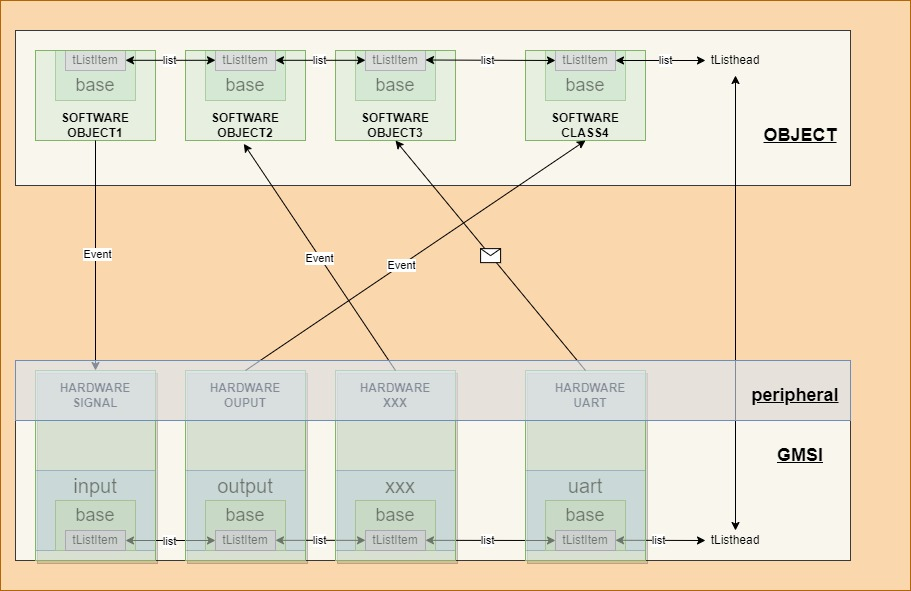

### GMSI框架

**Generic Mcu Software Infrastructure**



#### 文件分层介绍

```c
// gmsi主文件，对接main函数，子模块实例
gmsi.c/h
// gmsi通用接口实现
gmsi_common.c/h
// gmsi模块测试入口
gmsi_test.c/h
// gmsi配置入口，供用户裁剪设置使用
gmsi_configh.h
// gmsi子模块实现
src/
-------->>gmsi_base.c/h
-------->>gmsi_input.c/h
-------->>gmsi_output.c/h
-------->>gmsi_uart.c/h
// 继承gmsi/src下的模块进行硬件实现
peripheral/
-------->>hclass.c/h
// gmsi库无关接口实现和第三方库
utilities/
-------->>debug/
-------->>perf_counter/
-------->>PLOOC/
// gmsi框架图
image/
-------->>Base.drawio
-------->>framework.drawio
// 编写模板(注释满足Doxygen)
template/
-------->>gmsi_template.c/h
-------->>class_impl_template.c/h
-------->>class_app_template.c/h
```

+ **gmsi_lib**抽离硬件实现，制作**硬件中间层**并提供**通信服务**
  + gmsi_uart:实现出串口收发队列
  + gmsi_input:实现io读取操作
    + 内部做滤波相关操作，得到一个硬件输入信号，根据信号对外发送键值**event**
  + gmsi_output:需要提供硬件io写入操作函数
    + 接收外部控制信号，进行信号输出（电平/pwm）

+ **peripheral**规范与硬件相关接口，利用GMSI组件对其进行**硬件实例化**
  + 继承gmsi_lib，利用芯片库函数构造**hardware_class**

+ **class**是根据项目需要实现的功能模块化
  + 与**peripheral**接收或发送信息


#### GMSI理解与应用

##### SECTION语法

```c
typedef int (*gmsi_runfn_t)(void *ptObject);
typedef struct{
    void *ptObject;
    gmsi_runfn_t tfcnGmsiRun;
}gmsi_classrun_t;
// 声明外部变量
extern gmsi_classrun_t CLASSRUN$$Base;
extern gmsi_classrun_t CLASSRUN$$Limit;
// 创建gmsi_classrun_t变量指针，获取函数段的首尾地址
gmsi_classrun_t *ptGmsiAutoRunStart = &CLASSRUN$$Base;
gmsi_classrun_t *ptGmsiAutoRunEnd = &CLASSRUN$$Limit;
int gmsi_ClassRun(void)
{
    // 遍历Classrun函数段的所有函数并运行
    for(gmsi_classrun_t *p=ptGmsiAutoRunStart;p<ptGmsiAutoRunEnd;p++)
    {
        p->tfcnGmsiRun(p->ptObject);
    }
    return 0;
}

// 只要这个函数tfcnGmsiRun满足int (*gmsi_runfn_t)(void *ptObject),即可添加
static gmsi_classrun_t GMSI_USED SECTION("CLASSRUN") tGmsiClassRunLedBreahe = {
    .ptObject = NULL,
    .tfcnGmsiRun = utildebug_LedBreathe
};

```

##### GMSI_ID

```c
/*
	1、ID分两层结构
	2、高16bit保留
	3、高8bit为类
	4、低8bit为数字chNumber
*/ 
uint32_t wId;
//
// gmsiconfig.h
#define GMSI_ID_BASEOFFSET      8

#define GMSI_ID_INPUT           1
#define GMSI_ID_OUTPUT          2
#define GMSI_ID_UART            3
#define GMSI_ID_SPI             4
#define GMSI_ID_CAN             5
#define GMSI_ID_IIC             6
#define GMSI_ID_TIMER           7
#define GMSI_ID_CLASS           8

// 调用base基类时定义派生的属性
gmsi_base_cfg_t tGbaseClassCfg = {
    .wId = GMSI_ID_CLASS << GMSI_ID_BASEOFFSET,
};
// 创建类的配置结构体
typedef struct {
	// 类的编号唯一值（高八位为类）
    uint8_t chNumber;
}class_cfg_t;
// 派生类实例化时设定数值
void class_Init(class_t *ptClass, class_cfg_t *ptCfg)
{
    // new一个base
    ptClass->ptBase = gbase_New();
    // 确定ID并写入
    tGbaseClassCfg.wId +=  ptCfg->chNumber;
    // 派生类备份Id
    ptClass->wId = tGbaseClassCfg.wId;
    // base init
    gbase_Init(ptClass->ptBase, &tGbaseClassCfg);
}
```

##### LIST通信实现
###### LIST机制
```c
/* 
	1、根据目标id号遍历链表，提取对应的base
	2、把对应的event或message写入对应的base
*/    
// gmsi_base.c
	// 设置链表头部
struct xLIST        tListClass;

/*****************遍历链表函数段 start*****************/
	// 遍历链表，确定目的id
    for(ptListDes = listGET_HEAD_ENTRY(&tListClass);        \
        ptListDes != NULL;                                  \
        ptListDes = listGET_NEXT(ptListDes)
        )
    {
        if(ptListDes->xItemValue == wId)
            break;
    }
    
    // 找到对应的类实体
    if(NULL != ptListDes)
    {
        ptBaseDes = ptListDes->pvOwner;
		// 对目标base类进行操作
    }
/*****************遍历链表函数段 end*****************/
```

###### GMSI通信


```c
typedef struct{
    /*消息指针 具体类型根据应用确定 最多支持五个数据*/
    void *vpMessage[5];
    /* 消息长度 */
    uint16_t hwLength;
}message_t;
typedef struct {
    uint32_t wId;
    uint32_t wEvent;
    message_t *ptMessage;
    /* 控制的Id */
    // uint32_t wControlId;
    /* 串行所有类的链表节点 */
    struct xLIST_ITEM   tListItem;
}gmsi_base_t;

// 生产者
gmsi_uart_data_t tGmsiUartData;
void class1_Run(class_t *ptClass)
{
    // eg:从串口得到一帧数据chArrayData,长度为10
    tGmsiUartData.pchData = chArrayData;
    
    // 方式1
    message_t tMessage = {
      	.vppmessage = &tGmsiUartData,
        .hwLength = 1
    };
    // 将数据写入给某个id
    gbase_MessagePost(ptClass->ptBase, ptClass->wConsumerId, &tMessage);
}
// 消费者
void class2_Run(class_t *ptClass)
{
	gmsi_uart_data_t *ptGmsiUartData = (gmsi_uart_data_t *)gbase_MessageGet(ptClass->ptBase);
    if(NULL != ptGmsiUartData)
    {
        // 数据处理
    }
}
```

##### GMSI通用

###### 通用函数

+ 异常处理机制

```c
// 错误打印
void gcommon_PrintfError(gmsi_base_t *ptBase, greturn_error_t tGreturnErrorValue)
{
    // 输出错误来自那个对象
    LOU_OUT(ptBase->wId);
    switch(tGreturnErrorValue)
    {
        case GMSI_ERROR_INIT:
            
            LOG_OUT("Init Error\r\n");
            break;
        default:
            LOG_OUT("Unknow Error\r\n");
            break;
    }
}
// 遍历所有对象
void gcommon_PrintfObject(gmsi_base_t *ptBase)
{
    // UNUSE ptBase
    struct xLIST_ITEM *ptList;
    LOG_OUT("start list...\r\n");
    // 遍历链表
    for(ptList = listGET_HEAD_ENTRY(&tListClass);        \
        ptList != NULL;                                  \
        ptList = listGET_NEXT(ptList)
        )
    {
        LOG_OUT(ptList->xItemValue);
        LOG_OUT("-->");
    }
    LOG_OUT("\r\n end list...\r\n");
}
```


###### 返回值

```c
// GMSI返回值
#define GMSI_ERROR_INIT		-1
#define GMSI_ERROR_MALLOC	-2

typedef int32_t greturn_error_t;
typedef uint32_t greturn_value_t;
typedef void* greturn_point_t;
```


#### 使用方法

##### gmsi_xxx模板

+ 制作中间层供**peripheral**实现


##### class模板

+ 纯软件

```c
/*******************class.h start*************************/ 
// 创建类的配置结构体
typedef struct {
	// 类的编号唯一值（高八位为类）
    uint8_t chNumber;
    // 生产者id; eg:需要从某个类等待数据或事件
    uint32_t wProducerId;
    // 消费者id: eg:需要控制某个类，对其发送数据或事件
    uint32_t wConsumerId;
}class_cfg_t;
// 创建类的行为和动作
typedef struct {
    // 包含基类：具有通信和获取外部信号能力
    gmsi_base_t tBase;
    // 派生特性
}class_t;
/*******************class.h end***************************/ 

/* class.c */
void class_Init(class_t *ptClass, class_cfg_t *ptCfg)
{}
int class_Run(void *pvClass)
{
    class_t *ptClass = (class_t *)pvClass;
    // 状态机运行
    // 可根据外部信号以及数据进行动作
}
void class_Clock(void *pvClass)
{
    class_t *ptClass = (class_t *)pvClass;
    // 内部时钟自运行
}

/*****************其余特有API_START***********************/
void class_Aaa(class_t *ptClass);
void class_Bbb(class_t *ptClass);
void class_Ccc(class_t *ptClass);
/*****************其余特有API_END*************************/

/*******************实例调用******************************/ 
// 创建实例
class_t tClass;
class_cfg_t tClassCfg = {
    .chNumber = 1;
  	/* 传入配置 */  
};

// app.c
// 加载运行函数和时钟函数到对应的函数段SECTION
static gmsi_classrun_t GMSI_USED SECTION("CLASSRUN") tGmsiClassRun = {
    .ptObject = tClass,
    .tfcnGmsiRun = class_Run
};
static gmsi_clockrun_t GMSI_USED SECTION("CLOCKRUN") tGmsiClockRuntFlashledClock = {
    .ptObject = &tClass,
    .tfcnGmsiRun = class_Clock
};

// 在主函数初始化调用
class_Init(&tClass ,&tClassCfg);
```


### 编码要求

+ 使用四个空格替代TAB

+ 关于指针

  + 指针使用前要判断是非为空（NULL）

+ 关于布尔值

  + 尽可能使用stdbool.h提供的布尔型

  + 不允许直接使用0和1表示false和true。应该直接使用false和true。

  + 如果对应的C系统未提供stdbool.h可以自行定义，通常定义如下

    + ```c
      typedef enum {
          false = 0,
          true = !false
      } bool;
      ```

  + **绝对不允许在逻辑表达式中与true进行比较**。因为在布尔量中只有false是确定的值（0），true可以用任何非零值表示，是不确定的，因而要避免和true进行比较。

+ 关于命名规则

  + 变量

    + 变量使用名词性短语构成

    + 单词首字母大写

    + 单词与单词之间**不允许**用下划线隔开

    + 使用改良的匈牙利命名法

      + 使用改良的匈牙利命名法；用前缀表示变量类型；

      | 类型     | 前缀 | 注释         |
      | -------- | ---- | ------------ |
      | uint8_t  | ch   | byte         |
      | int8_t   | c    |              |
      | uint16_t | hw   | half-word    |
      | int16_t  | i    |              |
      | uint32_t | w    | word         |
      | int32_t  | n    |              |
      | uint64_t | dw   | double-word  |
      | int64_t  | l    |              |
      | float    | f    |              |
      | double   | df   | double-float |
      | bool     | b    | boolean      |
      | 函数指针 | fcn  |              |

      + 指针的前缀是“p”，指向指针的指针是“pp”，以此类推，一般用不到“pp”以上的。如果是函数指针，则用fcn

      + 所有自定义的变量类型前缀都是“t”

      + 对于特殊修饰的变量再加入不同的前缀

        + static型变量追加“s_”

        + 全局变量追加“g_”

        + const修饰的变量追加“c_”，当const和static同时出现使用“c_”

          ```c
          bool g_bFlag = false;			//!< 全局变量
          static uint16_t s_hwValue;		//!< 静态变量
          
          typedef struct {
              …
          }example_t;
          
          {
              example_t tExample ;		//!< 局部变量
          …
          }
          ```

      + 宏（Macro）与枚举（enum）

        + 由短语构成且一律**大写**
        + 单词与单词之间用下划线隔开
        + 有返回值的宏，请使用括号包裹起来（常数/常量除外）
        + 没有返回值的宏，请使用 do {} while(0) 包裹起来

      + 函数（Function）

        + 由短语构成且原则上一律**小写**
        + 模块名与描述单词之间用下划线隔开，其中描述单词首字母大写

  + 其他

    + 如果和常量进行“==”运算，常量应该放到表达式的左边

### 注释模板Doxygen

+ 文件头部

```c
/**
* @file         
* @brief		This is a brief description.
* @details	    This is the detail description.
* @author		author
* @date		    date
* @version	    v1.0
* @par Copyright(c): 	abc corporation
* @par History:         
*	version: author, date, desc\n
*/
```

+ 函数注释

```c
 /**
 * @brief		This is a brief description.
 * @details	    This is the detail description. 
 * @param[in]	inArgName input argument description.
 * @param[out]	outArgName output argument description. 
 * @retval		0		成功
 * @retval		ERROR	错误 
 * @par 标识符
 * 		保留
 * @par 其它
 * 		无
 * @par 修改日志
 * 		XXX于2023-10-03创建
 */
greturn_error_t gmsi_xxxInit(gmsi_xxx_t *ptxxx, gmsi_xxx_cfg_t *ptCfg);
```

+ 数据结构

```c
/** 
 * @brief		This is a brief description.
 * @details	    This is the detail description. 
 */
typedef struct
{
	int wVar1; /*!< Detailed description of the member var1 */
	int wVar2; /*!< Detailed description of the member var2*/
	int wVar3; /*!< Detailed description of the member var3 */
} gmsi_xxx_t;

```

+ 宏注释

```c
// 上方或者右方皆可
/** Description of the macro a */
#define a		0

#define b		0  /*!< Description of the macro b */

```

+ 全局和静态变量注释

```c
/**  Description of global variable  */
int g_qwe = 0;
 
int static  s_asd = 0; /*!< Description of static variable */
```

+ 常用标签命令关键字
  + 文件信息：
    + @file--> 文件声明，即当前文件名
    + @author --> 作者
    + @todo --> 改进，可以指定针对的版本
  + 模块信息：
    + @var --> 模块变量说明
    + @typedef --> 模块变量类型说明
  + 函数信息：
    + @param --> 参数说明
    + @arg --> 列表说明参数信息
    + @return --> 返回值说明
    + @retval --> 返回值类型说明
    + @note --> 注解
  + 提醒信息：
    + @brief --> 摘要，即当前文件说明
    + @see --> 参看
    + @attention --> 注意
    + @bug --> 问题
    + @warning --> 警告
    + @sa --> 参考资料
